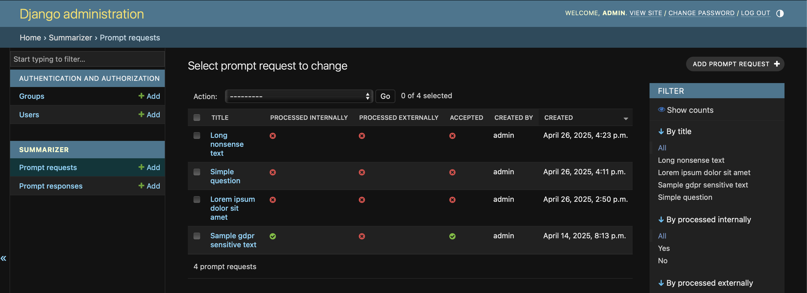

### Python ai agent to sumarize text with AI from user inputs

Application sends to OpenAI user prompt and gets response

For data privacy only prompt is send to ChatGPT, other details like contacts are stored locally

Application use Django framework and Django Admin panels to let users provides their inputs (just for simplyfing UI development)

Before running locally please generate OpenAI crednetials as specified in `Instructions` section below

### Manuals:

Log in to admin UI, select `Prompt Request` and click `Add Prompt Request`



When completed form list of prompt request select those which should be send to ChatGPT by checking checkboxes and selecting from the `Action` list `Send prompts to AI for selected request` and clicking on button `Go`


ChatGPT responses will be saved to `Prompt Response`


### Instructions:

All below commands are for MacOS, for Linux rather `python` should be used instead of `python3` to call Python from command line

Install Python3

Generate OpenAI creds:
https://platform.openai.com/settings/organization/general

Clone git repository

From project directory create vrtual env with `python3 -m venv aiagentenv`

Start virtual env by running `source aiagentenv/bin/activate`

Run `pip3 install -r requirements.txt` from project directory, if necessary install additional system packages (like Rust on MacOs, etc)

Rename file `env.sample` to `.env` and provide credentials there, databse credentails section can be skipped if SqLite local db will be used

Generate database by running migrations:

```python3 manage.py makemigrations summarizer```

```python3 manage.py migrate```

Create superuser to access admin panel:

```python3 manage.py createsuperuser```

Download Llama SLM from `https://huggingface.co/TheBloke/Llama-2-7B-Chat-GGML/tree/main` and place it in /libs

Finally run server:

```python3 manage.py runserver```

App is available under ```http://127.0.0.1:8000/panel/```

### Run Docker file:

Generate image from project directory with `docker build -t ai_agent-1.0 .`

Crate file with env vars

Run image with environment variable from file `docker run -p 8080:80 --env-file .env ai_agent-1.0`


### Additional links:

For more info on Django please go to: `https://docs.djangoproject.com/en/5.1/`

ChatGPT sample call:
```
curl https://api.openai.com/v1/models \
  -H "Authorization: Bearer $OPENAI_API_KEY" \
  -H "OpenAI-Organization: org-IeylwHKkgHRCyjerI4KgM32A" \
  -H "OpenAI-Project: $PROJECT_ID"
```

OpenAI library docs:

`https://platform.openai.com/docs/api-reference/debugging-requests`
