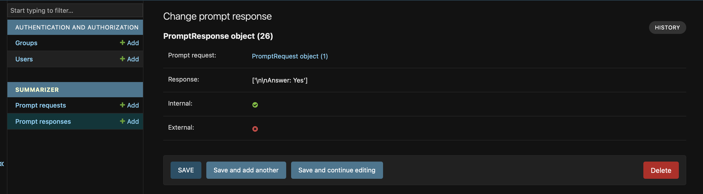

### Python ai agent to sumarize text with AI from user inputs

This is POCof  application for sumarizing text with AI. App utilize locally deployed SLM / LLM (currently Llama) and external OpenAI. Can be used for testing varoius SLM / LLM models run on locally on CPU. 

In first step application analyze provided text against sensitive data. Then it let user to summarize text wil local model. And then, if results are not satisfactory, prompt can be send to OpenAI.

Application use Django framework and Django Admin panels to let users provides their inputs (for simplyfing UI development). User level access can be defined with Django Groups.

Before running locally please generate OpenAI crednetials and download any open source model like Llama, as specified in `Instructions` section below.

### Manuals:

Log in to admin UI, select `Prompt Request`, click `Add Prompt Request` and provide data.


When completed from list of prompt requests select those which should be validated with internal AI model, by checking checkboxes and selecting from the `Action` list `Validate request with local model` and clicking on button `Go`


Do the same with `Summarize text with local model` and `Summarize text with external model`

All responses will be saved to `Prompt Response` (below internal model answer against question about sensitive data in prompt)



Bear in mind that locally hosted models are vary, results depends on model and its configuration.


### Instructions:

All below commands are for MacOS, for Linux rather `python` should be used instead of `python3` to call Python from command line

Install Python3

Generate OpenAI creds:
https://platform.openai.com/settings/organization/general

Clone git repository

From project directory create vrtual env with `python3 -m venv aiagentenv`

Start virtual env by running `source aiagentenv/bin/activate`

Run `pip3 install -r requirements.txt` from project directory, if necessary install additional system packages (like Rust on MacOs, etc)

Rename file `env.sample` to `.env` and provide credentials there, databse credentails section can be skipped if SqLite local db will be used

Generate database by running migrations:

```python3 manage.py makemigrations summarizer```

```python3 manage.py migrate```

Create superuser to access admin panel:

```python3 manage.py createsuperuser```

Download Llama SLM from `https://huggingface.co/TheBloke/Llama-2-7B-Chat-GGML/tree/main` and place it in `summarizer/libs` folder (create one if does not exist)

Other SLM / LLM from `https://huggingface.co` can be used as well

Finally run server:

```python3 manage.py runserver```

App is available under ```http://127.0.0.1:8000/panel/```

### Unit tests:

Run unit tests for internal slm / llm (to verify loaded model) by calling `python3 manage.py test summarizer.test.test_validator`

All test can be run with `python3 manage.py test` (more tests in progress)

### Run Docker file:
(still in progress)

Generate image from project directory with `docker build -t ai_agent-1.0 .`

Crate file with env vars

Run image with environment variable from file `docker run -p 8080:80 --env-file .env ai_agent-1.0`


### Additional links:

For more info on Django please go to: `https://docs.djangoproject.com/en/5.1/`

ChatGPT sample call:
```
curl https://api.openai.com/v1/models \
  -H "Authorization: Bearer $OPENAI_API_KEY" \
  -H "OpenAI-Organization: org-IeylwHKkgHRCyjerI4KgM32A" \
  -H "OpenAI-Project: $PROJECT_ID"
```

OpenAI library docs:

`https://platform.openai.com/docs/api-reference/debugging-requests`
